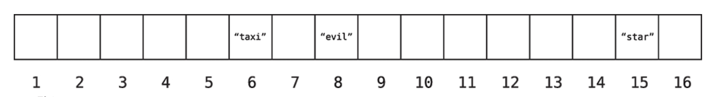
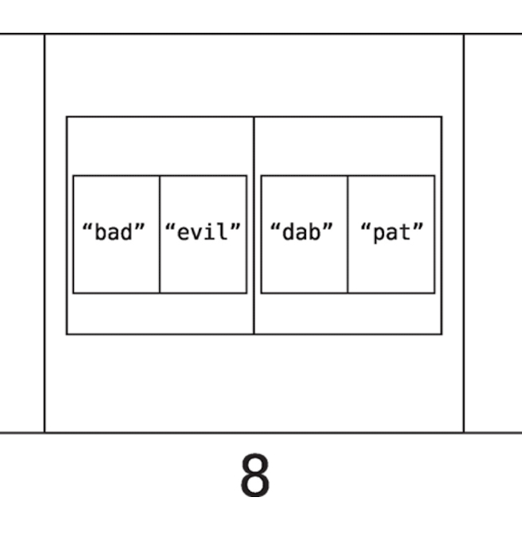

# 해시 테이블

- 빠른 읽기 가능
- 대부분 프로그래밍 언어에 있는 자료구조
- 해시, 맵, 해시 맵, 딕셔너리, 연관배열 등의 이름으로 불린다.
- 쌍으로 이루어진 값들의 리스트
- 키와 값으로 구성되기에 값 룩 업이 한 단계만 걸린다. O(1)

<br>

## 해시 함수의 해싱

```jsx
A = 1
B = 2
...
```

으로 맵핑을 하면 ACE = 135 등으로 변환할 수 있다.  
이와 같이 문자를 가져와 숫자로 변환하는 이런 작업을 **해싱**이라고 한다.  
글자를 특정 숫자로 변환하는데 사용한 코드는 **해시 함수**라고 부른다.

해시 함수가 되기 위해선, 동일한 문자열에 대한 결과가 동일한 숫자여야하고 단방향이어야 한다.

<br>

## 유의어 사전 만들기

해싱을 통해 동작하는 단어 저장 프로그램을 만들어보자.  
해싱 알고리즘은, 알파벳 순서의 곱의 총 합으로 정하겠다.  
(BAD = 2 X 1 X 4 = 8 )

```jsx
thesaurus['bad'] = 'evil';
thesaurus['cab'] = 'taxi';
thesaurus['ace'] = 'star';
```

해시 테이블은 배열과 유사하게 내부적으로 데이터를 한줄로 이루어진 셀 묶음에 저장한다.  
우리가 정한 해시 함수로 변환한 해시 테이블은 아래와 같다.  


<br>

### 조회 (룩업)

thesarus['bad']의 값을 찾고싶을때 컴퓨터는 어떻게 동작할까?

1. bad를 해싱한다. (bad = 2X1X4 = 8)
2. 셀 8을 찾아 결과를 반환한다.

정해진 키를 해싱을 통해 셀을 찾을 수 있기 때문에 O(1)

<br>

### 단방향

단 해시 테이블에서 한단계만에 찾을 수 있을땐 키를 알고 있을떄 뿐이다.  
키를 모른다면 일반 배열처럼 순회탐색을 해야 한다. O(N)  
또한 거꾸로 값을 통해 키를 찾는다면 한단계만에 찾을 수 없고 순차탐색을 해야한다.  
위 그림에선 값만 저장했는데 키는 주로 값 바로 옆에 저장한다고 한다. 충돌에 있어 유용하다.  
키는 유일하지만, 값은 여러개가 있을 수 있다. 2달러 짜리 햄버거 메뉴가 여럿 존재할 수 있는것처럼.

<br>

### 충돌 해결

지금 우리가 만든 해시 함수로는 충돌이 발생한다.

dab를 키로 만들어도 8 bad를 키로 만들어도 8이다.  
고전적인 해결법중 하나는 **분리 해결법**이다. 충돌시 셀 하나안에 배열을 넣어준다. (정확히는 참조 할수 있도록 한다.)  


조회 시, 똑같이 키를 해싱하고 셀에 온 후, 순차탐색으로 키와 동일한 키를 찾는다.  
다만 한 셀에 모든 데이터가 있다면 배열보다 나을것이 없으므로 디자인을 잘 해야 한다. 충돌이 거의 없도록.  
대부분 프로그래밍 언어에서는 대신 처리해준다.  
어떻게 해시테이블을 설정해야 충돌이 가능한 적게 일어날까?  
어떻게 간신히 O(1)성능을 유지할까?

<br>

## 효율적인 해시 테이블 만들기

아래의 요소로 인해 해시 테이블의 효율성이 정해진다.

- 해시테이블에 얼마나 많은 데이터를 저장하나
- 해시 테이블에서 얼마나 많은 셀을 쓸 수 있나
- 어떤 해시 함수를 사용하나

좋은 해시 함수란, 충돌이 적게끔 모든 셀에 데이터를 분산시키는 함수.

### 충돌 조정

충돌 횟수가 줄어들 수록 해시테이블의 효율성이 높아진다.  
해시 함수가 좋다고 가정한다면 셀의 개수가 충분히 많다면 충돌은 일어나지 않는다.  
다만 충돌을 피한다고 메모리를 많이 잡아먹지 않도록 균형을 잘 맞춰야한다.  
따라서 **메모리를 많이 낭비하지 않으면서 균형을 유지하면서 충돌을 피하는것이 좋은 해시테이블**이다.  
컴공 사람들은 귀납적으로 규칙을 세웠다. 저장되는 데이터가 7개라면 셀은 10개여야 한다.  
이 비율을 부하율(load factor) 이라고 한다. 이상적인 부하율은 0.7  
따라서 해시테이블에 데이터를 7개 저장한다면 컴퓨터는 10개의 셀을 준비한다.  
대부분의 언어에서는 이 부분이 구현 되어 있기 때문에 해시테이블이 얼마나 커야하는지, 어떤 해시 함수를 쓰는지, 언제 스케일업 할지 알아서 결정한다.

## 다양한 사례

### 해시 테이블로 데이터 조직

어떤 데이터는 본래 쌍 형태. (사전, 메뉴-가격 등) 파이썬 에서는 해시테이블을 딕셔너리라고 부른다. 이런 쌍으로된 데이터와 해시 테이블은 잘 들어맞아, 어떤 경우엔 해시테이블로 조건부 로직을 간소화 가능하다.  
(자바스크립트에서의 if문 -> 객체 맵핑)

또한 다양한 속성을 갖는 객체를 표현해 데이터를 관리한다.  
(자바스크립트에서 배열 안 객체)

### 해시 테이블로 속도 올리기

쌍으로 된 데이터가 아니더라도, 코드를 빠르게 만들 때 쓰인다.  
숫자로 된 배열에서, 숫자로 된 키를 갖고 값은 true인 해시 테이블을 만들어 값이 있는지 없는지 쉽게 파악 할 수 있다.

```jsx
hash_table[72]; //true
hash_table[12]; //undefined
```

저자는 해시 테이블을 인덱스로 사용하기 라고 부룬다고 한다.  
이를 통해 부분 집합인 배열을 찾는 등 많은 응용을 할 수 있다.
