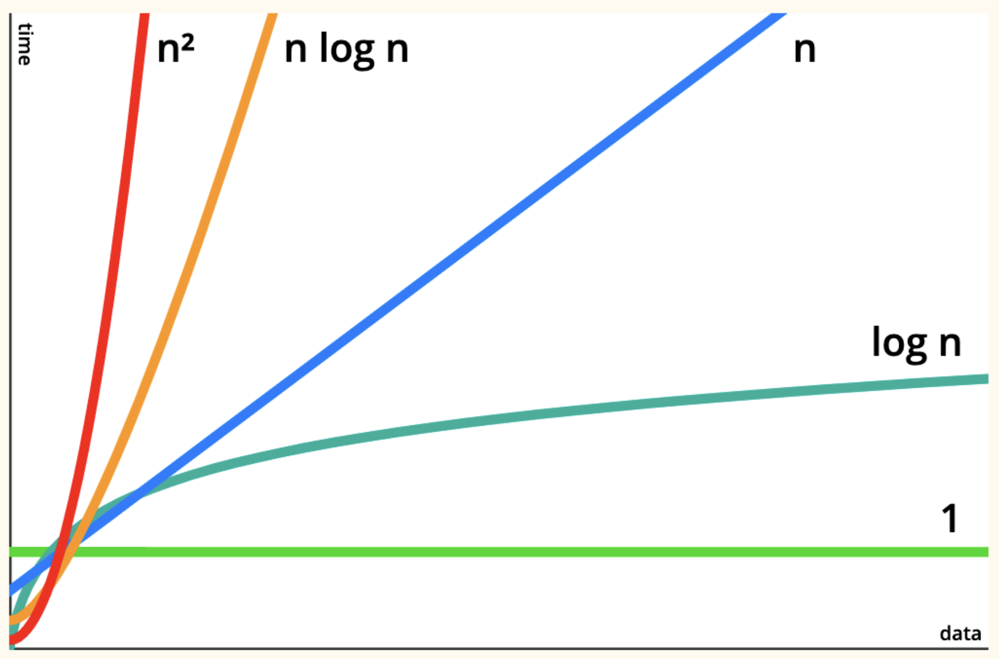

# 13장. 속도를 높이는 재귀 알고리즘

## 퀵정렬을 통한 재귀알고리즘 탐구

대부분의 프로그래밍 언어의 내장함수는 퀵정렬을 사용하여 정렬 알고리즘을 구현한다. 최악의 시나이오에서는 삽입 정렬이나 선택 정렬이 퀵 정렬보다 빠르지만 평균적인 시나리오에서 퀵정렬이 훨씬 효율적이다. 퀵 정렬은 분할(partitioning)이라는 개념에 기반한다.

 

## 퀵 정렬

퀵 정렬은 분할과 재귀로 이뤄진다.

 

### 분할

분할은 임의의 피벗값(주로 제일 마지막 인덱스)을 정하여 피벗값을 기준으로 작은값들은 왼쪽, 큰값들은 오른쪽에 위치하도록 배열을 구분하는 작업이다. 피벗값을 기준으로 큰지 작은지만 구분이 되면 충분하며, 구분된 한 쪽이 온전히 정렬되어 있지 않아도 좋다.

 

### 재귀

분할이 1회 완료되면 피벗값을 기준으로 왼쪽배열, 오른쪽 배열로 구분된다. 그러면 이때 재귀로직이 들어간다. 왼쪽과 오른쪽 배열에 대해서 각각 분할과정을 실행하는 것이다. 그리고 배열이 완전히 정렬 될 때까지 재귀적으로 반복해서 실행한다. 최하위까지 완료되면 배열은 온전히 정렬되어있다.

 

## 퀵 정렬의 효율성

| 퀵 정렬 단계 수 | N x LogN |
| --------------- | -------- |
| 8               | 8        |
| 24              | 24       |
| 64              | 64       |
| 160             | 160      |

위 표를 보면 알 수 있듯이 퀵정렬의 빅오는 O(NlogN)이다. 다른 빅오와 효율성 차이를 보면 아래와 같다.

퀵 정렬을 삽입 정렬과 비교해보자.

|           | 최선의 경우 | 평균의 경우 | 최악의 경우 |
| --------- | ----------- | ----------- | ----------- |
| 삽입 정렬 | O(N)        | O(N^2)      | O(N^2)      |
| 퀵 정렬   | O(NLogN)    | O(NLogN)    | O(N^2)      |

물론 최선의 경우에서는 퀵정렬이 효율적이지 못해 보인다. 하지만 중요한 것은 평균의 경우이다. 정규분포를 따르는 현실에는 평균의 경우가 더 잦은 빈도로 나타나기 때문에 전체적으로 봤을 때 퀵 정렬의 효율성이 매우 빠르다고 볼 수 있다. (그래서 이름도 퀵 정렬인지도 모르겠다.)

대부분의 프로그래밍 언어의 내장 메서드로서 정렬은 퀵 정렬으로 구현되어 있다고 한다.

 

## 퀵 셀렉트

퀵 정렬의 로직을 응용하면 퀵 셀렉트도 구현 할 수 있다. 퀵 셀렉트는 분할과 이진검색으로 이루어져있다. 모든 배열에 대해서 정렬 후 검색을 하는 것이 아니라 분할 진행 후 한쪽 부분에만 집중하여 값을 찾아가는 방식으로, 전체 배열을 정렬하지 않아도 원하는 값을 찾아낼 수 있다는 장점이 있다.

 

### 분할

퀵 정렬과 동일하게 진행한다.

 

### 이진검색

특정 값을 기준으로 내가 찾고자 하는 값이 존재하는 부분에만 집중하여 분할을 진행한다.

 

### 퀵 셀렉트의 효율성

평균적인 시나리오에서의 퀵 셀렉트의 효율성은 O(N)이다. 일반식으로 표현하면 N + N/2 + N/4 .... + 2 인데 이를 모두 합하면 약 2N이다. 하지만 빅오에서 상수는 무시하므로 O(N)이 된다.
