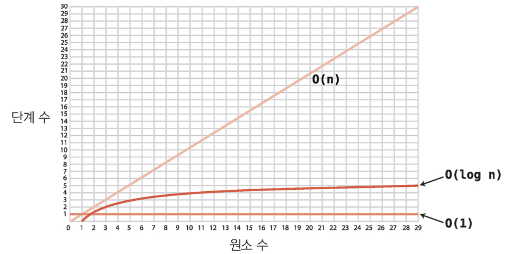

# 빅 오 표기법

 

알고리즘의 효율성을 따질땐 어떤 방법을 써야 할까?  
"배열에 N개의 원소가 있을때, 선형검색을 한다면 N개의 단계가 필요해!" 라고 말하는것은 너무 장황하지 않을까?

효율성에는, 시간이 얼마나 걸렸을지, 메모리 공간을 얼마나 차지했을지가 가장 큰 기준인데 오늘은 그 기준 중 하나인 시간복잡도에 대해 알아보자☺️

## 원소가 N개일땐 몇 단계?

아까 했던 질문이다. 데이터 원소가 N개라면 알고리즘엔 몇 단계가 필요할까?  
어떤 알고리즘이냐에 따라 다르겠지만, 이것들을 단순화 해 우리는 빅 오 표기법으로 나타낸다.  
**O(N)** 은 알고리즘에 N 단계가 필요하다는 말이다.  
 
그 중 가장 빠른 알고리즘 유형은 **O(1)** 인데 이 말은 원소가 몇개이든 1단계만 거치면 된다는 말이다. 배열의 읽기처럼.  
**O(1)** 은상수 시간을 갖는 알고리즘 이라고도 한다.

## 빅 오의 본질

헷갈리는 것이 있는데, 그럼 데이터가 몇개이던 3단계가 필요하다면 이것은 빅 오로 **O(3)** 일까?

떙!

아니다 **O(1)** 이다.  
빅 오의 본질은 **데이터가 늘어날 때 알고리즘의 성능이 어떻게 바뀌냐** 이다. 그렇기에 다른것 생각하지말고, 데이터가 늘어날때 대비 단계수가 어떻게 증가하는지를 보면 계산이 쉽다.

(사실, 고등학교 때 배운 극한을 생각하면 쉽다 ... 상수 무시, 차수만 의미 있던 )

 

### 그럼 만약 상수가 100이라면, 1000이라면, 1억이라면?

그럼 O(N)보다 효율성이 안 좋은 부분이 있는데 더 우수한 알고리즘이라고 볼 수 있나?  
100보다, 1000보다, 1억보다 큰 무한히 많은 모든 배열에서는 O(N) 알고리즘에 더 많은 단계가 걸린다. 따라서 O(1)의 상수만큼 일정한 단계보다 그 이상의 무한한 단계가 더 많으므로 O(1)이 상대적으로 효율적인 알고리즘이다.

### 같은 알고리즘, 다른 시나리오

항상 단계를 생각할땐 최악으로 생각해야 된다.  
배열의 선형 탐색도 최선은 O(1), 최악은 O(N)이므로, 빅 오 표기법은 일반적으로 최악을 따라간다.  
비관적인 접근이 유용한 도구일 수 있기 때문에.

## 세 번째 유형의 알고리즘

2장에서 본 이진 검색의 경우 O(1)과 O(N) 사이였다.  
수학적으로 나타내면 **O(logN)** 로그시간 복잡도 라고 한다.  
데이터가 두배로 증가할 때 한 단계씩 늘어나는 알고리즘을 설명하는 방법.

## 로가리즘

로그는 로가리즘의 줄임말이다.  
지수와 역의 관계.  
2의 몇승이 64지?  
여기서 몇 승이 담당하는것이 로그. 6이다.  
log2 64 = 6

혹은 1이 나올때까지 몇번을 2로 나눠야 할까? 로 설명할 수도 있다.

## O(logN) 해석

컴퓨터 과학에서 logN은 log2의 N을 줄여서 말하는 말이다.  
따라서 원소가 N개 있을때 log2의 N단계가 걸린다는 말. 원소 N을 절반으로 나눠서 1이 될 때까지 걸리는 단계.  
간단히 말해 O(logN)은 원소가 하나가 될 떄 까지 데이터 원소를 계속해서 반으로 줄이는 만큼의 단계.
